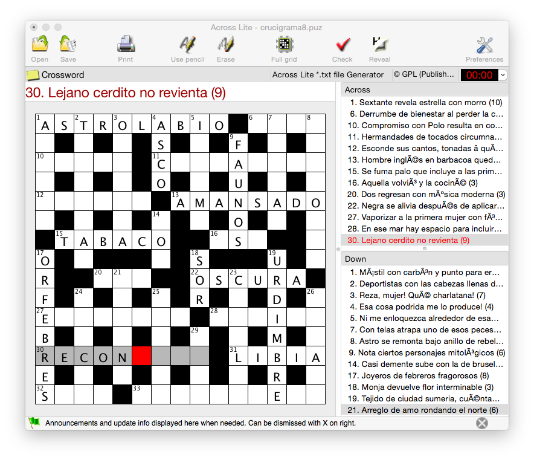

Across Lite *.txt file generator 
================================

Across Lite accepts a file format that can be created 'by hand'.
See [documentation about Across Lite format [PDF]](http://www.litsoft.com/across/docs/AcrossTextFormat.pdf)

After loading the txt file generated by this script, you can generate a *.puz file for your crossword.

PUZ file format is commonly used by commercial software for crossword puzzles.

# How it works?

Put proper data in data_arrays.py
(Take a look at data_arrays.py file)

Then, run

    python gen.py > <path>/<filename>.txt

e.g.

    python gen.py > data/elcriptico/crucigrama8/crucigrama8.txt

File contents look like the following:

    <ACROSS PUZZLE>
    <TITLE>
         Crossword
    <AUTHOR>
         Across Lite *.txt file Generator
    <COPYRIGHT>
         GPL
    <SIZE>
         15x15
    <GRID>
    ASTROLABIO.ALUD
    S.E.R.S.N.F.O.I
    CINTA.COFRADIAS
    E.I.D.O.A.U.N.C
    TOSTON.AMANSADO
    A.T.R.C.E.O.S.L
    .TABACO..ASE..O
    O.S...L.S...U.S
    R..RAP..OSCURA.
    F.P.D.C.R.H.D.S
    EVAPORAR.CARIBE
    B.R.R.M.L.R.M.M
    RECONDITO.LIBIA
    E.H.O.O.O.A.R.N
    SOEZ.INTRINSECA
    <ACROSS>
         Sextante revela estrella con morro (10)
         Derrumbe de bienestar al perder la cabeza (4)
         Compromiso con Polo resulta en cordón (5)
    <DOWN>
         Mástil con carbón y punto para ermitaño (6)
         Deportistas con las cabezas llenas de nitrógeno singular (8)
         Reza, mujer! Qué charlatana! (7)
    <NOTEPAD>
    Good luck

Here is a screen capture of the file when loaded in Across Lite

